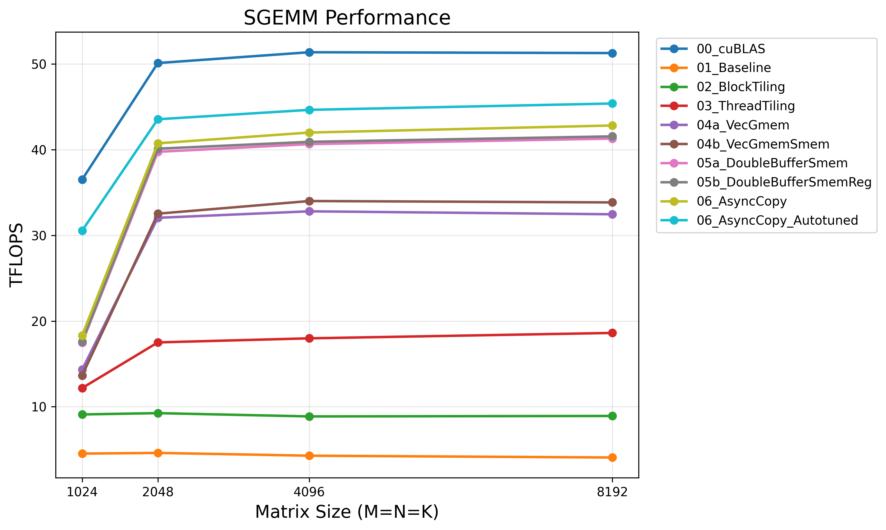

# CUDA SGEMM Optimization

A step-by-step exploration of GEMM optimization techniques on NVIDIA GPUs.

## Requirements

- CUDA Toolkit (tested with 12.x)
- GPU with SM 80+ (Ampere or later) for async copy kernels
- Python 3 + matplotlib (for plotting)

## Build & Run

Make sure to set `ARCH` to match your GPU architecture (e.g., sm_90, sm_80, etc.).

```bash
make ARCH=sm_90
./gemm_bench
python3 scripts/plot_results.py gemm_results.csv
```

## Kernel Progression

| Kernel | Description |
|--------|-------------|
| 00_cublas | cuBLAS reference (FP32, no tensor cores) |
| 01_baseline | Naive: one thread per output element |
| 02_block_tiling | Shared memory tiling for A and B |
| 03_thread_tiling | Each thread computes TM×TN output tile |
| 04a_vec_gmem | + Vectorized global memory loads (float4) |
| 04b_vec_gmem_smem | + Vectorized shared memory loads |
| 05a_double_buffer_smem | + Shared memory double buffering |
| 05b_double_buffer_smem_reg | + Register double buffering |
| 06_async_copy | + Asynchronous GMEM→SMEM copies (cp.async) |

## Results
* **NVIDIA H200 SXM (141 GB HBM3e)**

